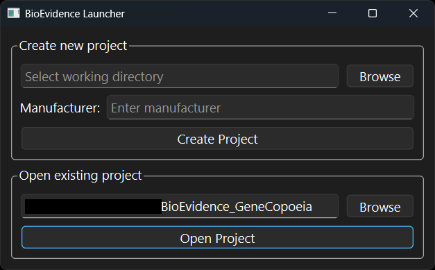
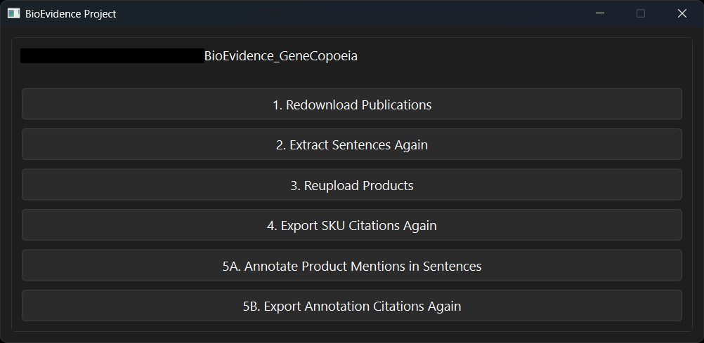
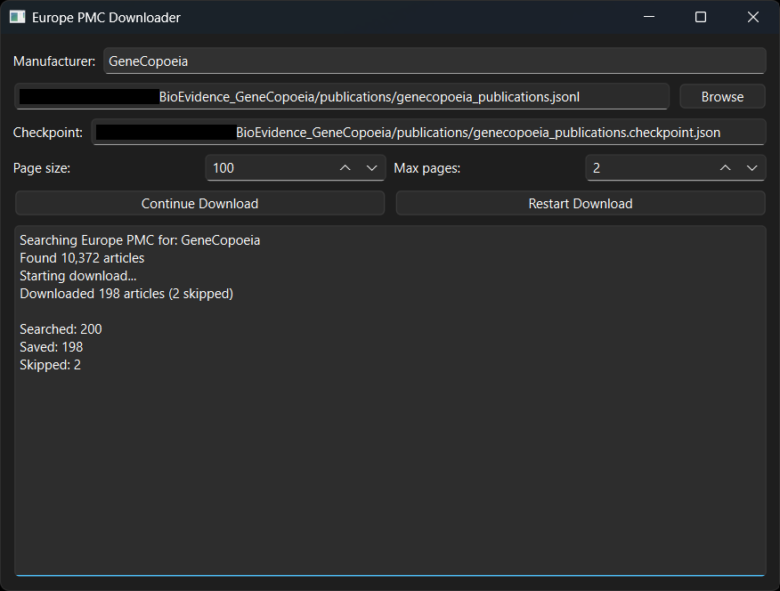
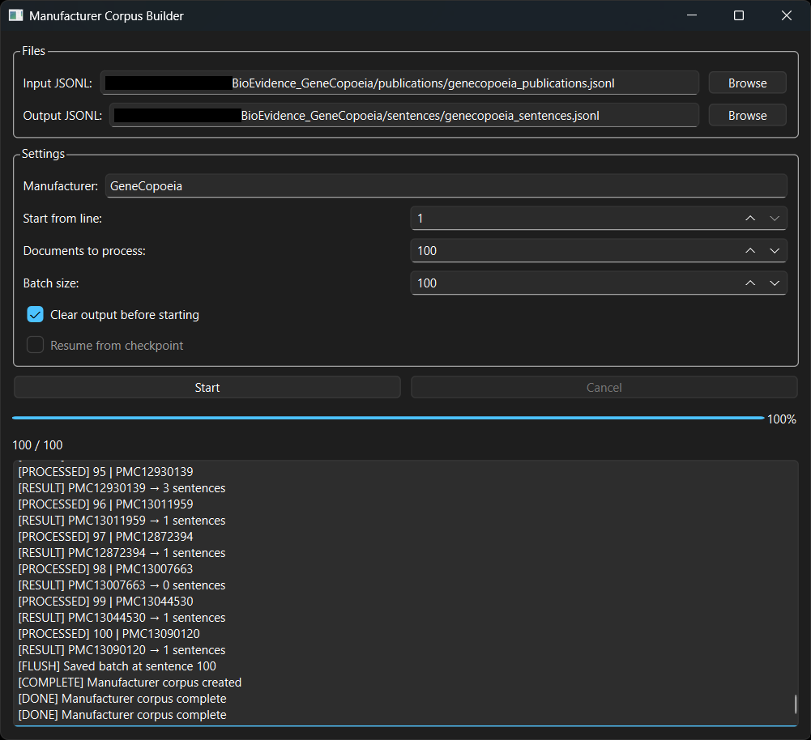
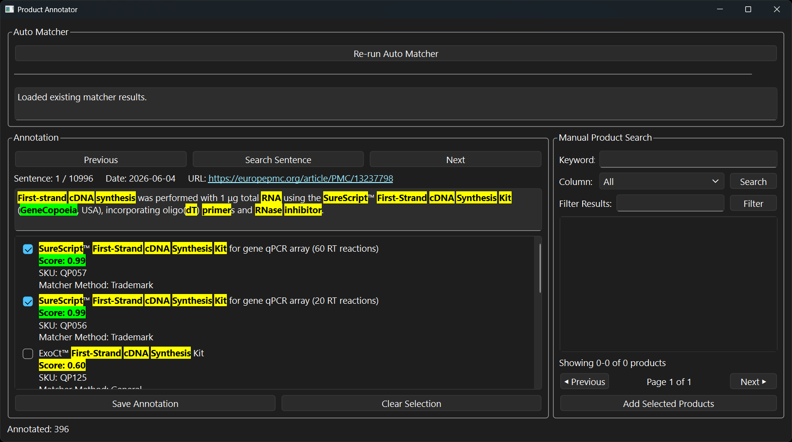

# BioEvidence Finder

BioEvidence Finder is a desktop application for discovering and validating biotech product mentions in scientific publications from Europe PMC.

The application combines literature retrieval, sentence extraction, product matching, manual annotation, and citation generation into a single PySide6 interface, making it easier to build evidence for biotechnology products.

<p>


</p>

<p>


</p>



## Features
- Download publications from Europe PMC
- Build a manufacturer-specific sentence corpus
- Detect product mentions using a high-speed SKU and alias matcher
- Review and validate matches through an annotation interface
- Generate citation reports for validated evidence
- Manage projects through a unified desktop interface


## BioEvidence Finder follows a five-stage pipeline:

1. Publication Downloader
    - Downloads publications from Europe PMC using the manufacturer as the query.
    - Output: publication metadata in a .jsonl file

2. Sentence Corpus Builder
    - Acquires full text from downloaded publications and splits them into sentences
    - Extracts sentences mentioning manufacturer
    - Output: sentences containing manufacturer attached with publication metadata

3. Product Importer
    - Asks user for .csv files of their products
    - Asks user for 3 columns for an unique identifier (SKU), product name, and description
    - Creates a product index cache for matching based on the user's imports
    - Output: product_index.msgpack cache for matching

4. Quick SKU Matcher
    - Matches shortened and exact SKUs (unique identifiers) against sentence corpus using the prebuilt product index
    - Output: .csv file of citations for a publication along with matched SKUs, matched product names, and sentences 


5. Annotation UI
    - Allows user to validate or reject automatically generated string matches
    - User can manually search products
    - User saves annotation of correctly matched products
    - User can select all variations of a product if an exact SKU cannot be deduced because of unknown size or edition
    - Output: .json of manually validated annotations for each sentence

6. Citation Generator
    - Creates citations for a publication based on annotations
    - Publications will separate multiple products with a semicolon ";"
    - Products with multiple SKUs attached to a single product will be delimited by a slash "/"
    - Output: .csv file of citations for a publication along with matched SKUs, matched product names, and sentences 


## Project Structure

```
BioEvidenceFinder/
│
├── launcher.py
├── launcher_window.py
│
├── windows/
│   ├── downloader_window.py
│   ├── project_manager_window.py
│   ├── manufacturer_corpus_window.py
│   ├── sku_results_window.py
│   ├── annotator_window.py
│   └── annotation_results_window.py
│
├── core/
├── matching/
├── corpus/
├── citation/
├── utils/
│
├── data/
│   ├── products/
│   └── caches/
│
└── projects/
```


## Installation

### Clone the repository:

git clone https://github.com/david-n-lu/pub-proof.git
cd pub-proof

### Create a virtual environment:

python -m venv .venv

Activate it:

```
Windows
.venv\Scripts\activate

macOS / Linux
source .venv/bin/activate
```

### Install dependencies:

pip install -r requirements.txt

### Launch the application:

python main.py


## Building the Executable

BioEvidence Finder can be packaged into a standalone Windows executable using PyInstaller and the provided `launcher.spec` file.

### Install PyInstaller

Make sure your virtual environment is activated, then install PyInstaller: ```pip install pyinstaller```

The `.spec` file defines the application entry point, included resources, hidden imports, and executable settings.

The provided spec file also includes the required PySide6 dependencies and application resources needed for the packaged application.

### Output

After the build completes, PyInstaller creates:
```
dist/
└── BioEvidenceFinder/
└── BioEvidenceFinder.exe
```

The entire folder generated in `dist/` should be kept together when distributing the application. The executable depends on the bundled libraries and resources included alongside it.

The executable can be launched directly without requiring a Python installation, as long as all required resources are included in the build.

### Updating the executable

Whenever source code changes are made, rebuild the executable by running: ```pyinstaller launcher.spec --clean```

The `--clean` flag removes cached build files to ensure the latest source files are included.


## Creating a Project
Launch BioEvidence Finder.
Choose a workspace directory.
Enter the manufacturer name.
Create the project.
Follow the pipeline from publication download through citation generation.

## Technologies
Python
PySide6
pandas
Europe PMC REST API


## Current Scope

BioEvidence Finder is designed to support multiple biotechnology manufacturers, but the current implementation has been developed and tested using GeneCopoeia products and Europe PMC publications.


Several components—including the product index, alias mappings, and citation workflow—currently assume GeneCopoeia data formats. Adapting the application to additional manufacturers primarily involves adding manufacturer-specific preprocessing logic.

Future versions aim to provide a generalized workflow that supports multiple manufacturers with minimal configuration.


## Current GeneCopoeia-specific Logic
<strong>
- Shortening product names for citations and auto match scoring <br>
- Shortening SKUs for more matches in Quick SKU Matcher <br>
- Extracting old SKUs in product name for more matches in Quick SKU Matcher <br>
- Using a "Description" column to differentiate poorly named, ambiguous product names <br>
- Having code processing dashes "-" for string matching <br>
<br>

Most of this logic is placed in ```matching/normalization.py```, ```product_building/product_map.py```, and ```citation_generator/citation.py```
<br>
</strong>


## Future Improvements
Improved product matching
LLM-assisted annotation
Additional literature databases


## License

This project is licensed under the MIT License.